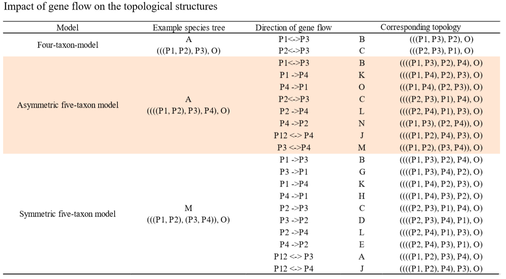
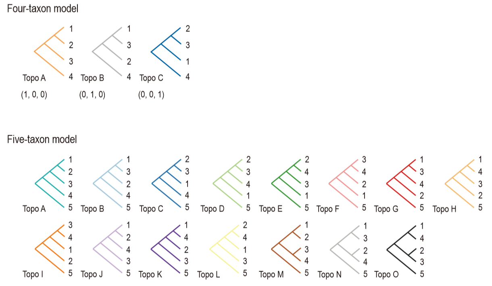
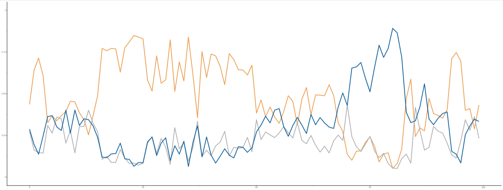
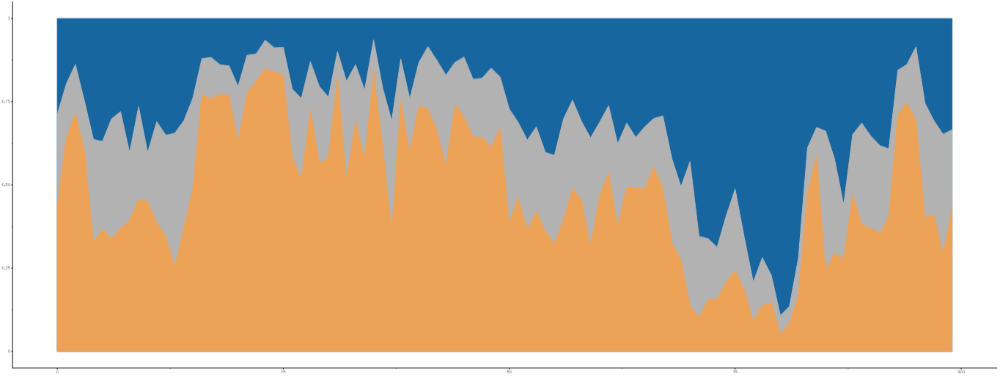

# ERICA
> Evolutionary Relationship Inference using a CNN-based Approach

## Usage

The ERICA pipeline consists of 3 steps:  
1. Generating custom sequence files
2. Evaluating evolutionary relationships
3. Finding discordant patterns and signatures of genome-wide and local introgression

### Compilation
#### Generating custom sequence files

ERICA uses a multiple sequence alignment (MSA) as input to evaluate evolutionary relationships. A DNA sequence alignment without any other annotation should be provided. Adjacent eight lines will be recognized as belonging to one taxon. Thus, MSAs containing 32 and 40 lines are required for the four-taxon and five-taxon analyses, respectively.

A demo of 8 sequence alignment:
```
TGGATTCGTCCGCCCAGGCACATCACAGAGCAATCAGACCTCGCAAACTA
TGGTTTCGTCCGCTCAGGCACATCACTGAGCAATCAGACCTCGCAAACTA
TGGTTTCGTCCGCCCAGGCACATCACAGAGCAATCAGACCTCGCNTACTA
TGGNTTCGTCCGCCCAGGCACATCACTGAGCAATCAGACCTCGCAAACTA
TGGTTTCGTCCGCTCAGGCACATCACTGAGCAATCAGACCTCGCAAACTA
TGGTTTCGTCCGCCCAGGCACATCACTGAGCAATCAGACCTCCCAAACTA
TGGATTCGTCCGCCCAGGCACNTCACTGAGCAATCAGACCTCGCATACTA
TGGATTCGTCCGCCCAGGCACATCACTGAGCAATCAGACCTCGCAAACTA
```
Users can use algorithms such as [Clustal W](http://www.clustal.org/clustal2/) or [LASTZ](http://www.bx.psu.edu/~rsharris/lastz/) for whole genome alignment. For a population-level study, genotype data storing in the format of [Variant Call Format (VCF)](https://doi.org/10.1093/bioinformatics/btr330) can be used. Users can use `vcf2MSA.py` to convert custom VCF files to MSA format.

An example of VCF:
```
##fileformat=VCFv4.2
#CHROM  POS     ID      REF     ALT     QUAL    FILTER  INFO    FORMAT  H_m_amaryllis_1 H_m_amaryllis_2 H_ethilla_1     H_ethilla_2     H_ethilla_3     H_ethilla_4     H_m_amaryllis_3 H_m_amaryllis_4      H_t_thelxinoe_1 H_t_thelxinoe_2 H_t_thelxinoe_3 H_t_thelxinoe_4 H_m_aglaope_1   H_m_aglaope_2   H_m_aglaope_3   H_m_aglaope_4
Hmel218003o     7295    .       A       T       138.17  .       .     GT:AD:DP:GQ:PL  0/0:14,0:14:36:0,36,491 0/0:10,0:10:24:0,24,332 0/0:24,0:24:63:0,63,827      0/1:6,6:12:99:150,0,194 0/0:13,0:13:39:0,39,512 0/0:26,0:26:66:0,66,880 0/0:20,0:20:60:0,60,742 0/0:33,0:33:99:0,99,1210        0/0:34,0:34:90:0,90,1198        0/0:23,0:23:69:0,69,912      0/0:25,0:25:69:0,69,953 0/0:19,0:19:54:0,54,752 ./.:.:.:.:.     ./.:.:.:.:.     0/0:10,0:11:3:0,3,28    ./.:.:.:.:.
Hmel218003o     7315    .       G       C       27719.2 .       .      GT:AD:DP:GQ:PL  0/0:19,1:20:12:0,12,639 0/1:7,15:22:99:408,0,230        ./.:.:.:.:. ./.:.:.:.:.      ./.:.:.:.:.     ./.:.:.:.:.     0/1:15,10:25:99:251,0,442       0/0:27,0:27:78:0,78,944 1/1:1,29:30:84:1113,84,0        1/1:0,21:22:60:808,60,0 1/1:0,25:25:66:901,66,0 1/1:0,24:24:66:907,66,0      ./.:.:.:.:.     1/1:6,6:13:12:137,12,0  1/1:7,4:12:9:80,9,0     ./.:.:.:.:.
Hmel218003o     7319    .       T       A       1723.26 .       .     GT:AD:DP:GQ:PL  0/0:21,1:22:18:0,18,711 0/1:7,15:22:99:408,0,236        0/0:23,0:23:69:0,69,853      0/0:13,0:13:36:0,36,438 0/0:14,0:14:36:0,36,480 0/0:29,0:29:84:0,84,1058        0/1:15,10:25:99:263,0,443       0/0:29,0:29:84:0,84,1024        0/0:31,0:31:84:0,84,1139    0/0:23,0:23:69:0,69,930  0/0:26,0:26:69:0,69,945 0/0:24,0:24:66:0,66,910 ./.:.:.:.:.     0/1:7,7:15:10:156,0,10  1/1:9,4:13:9:80,9,0     ./.:.:.:.:.
Hmel218003o     7335    .       C       G       40227.2 .       .   GT:AD:DP:GQ:PL  1/1:1,16:17:9:580,9,0   0/1:16,8:24:99:264,0,410        1/1:0,20:20:60:742,60,0      1/1:0,13:13:39:456,39,0 1/1:0,12:12:30:393,30,0 1/1:0,28:28:81:1017,81,0        0/1:13,10:23:99:255,0,376       1/1:0,29:29:84:1016,84,0        1/1:0,30:30:87:1123,87,0    1/1:0,23:23:60:790,60,0  1/1:0,25:25:69:913,69,0 1/1:0,23:23:66:878,66,0 ./.:.:.:.:.     0/1:7,9:16:10:10,0,156  0/0:7,10:17:18:0,18,174 ./.:.:.:.:.
Hmel218003o     7342    .       C       T       7335.32 .       .      GT:AD:DP:GQ:PL  1/1:1,15:16:6:540,6,0   0/1:17,8:25:99:269,0,449        0/0:23,0:23:69:0,69,849      0/0:12,0:12:36:0,36,417 0/0:12,0:12:30:0,30,385 0/0:26,0:26:78:0,78,981 0/1:15,11:26:99:278,0,384       1/1:0,28:28:81:976,81,0 0/0:30,0:30:81:0,81,1086        0/0:23,0:24:63:0,63,804      0/0:25,0:25:66:0,66,856 0/0:25,0:25:69:0,69,908 ./.:.:.:.:.     0/1:7,9:16:10:10,0,160  0/0:10,8:18:24:0,24,253 ./.:.:.:.:.
```


#### Evaluating evolutionary relationships

For each MSA, we focus on the topology of its phylogenetic tree. Taking a four-taxon phylogeny for example, which contains three ingroup taxa and one outgroup taxon, there are three possible topological structures:

```
             /-P1                        /-P1                       /-P2
          /-|                         /-|                        /-|
       /-|   \-P2                  /-|   \-P3                 /-|   \-P3
      |  |                        |  |                       |  |      
    --|   \-P3                  --|   \-P2                 --|   \-P1
      |                           |                          |
       \-O                         \-O                        \-O
        
        Topo A                      Topo B                      Topo C
       （1,0,0）                   （0,1,0）                   （0,0,1）
```
However, one strict bifurcated tree cannot represent the real relationship of the ingroup taxa, especially when a focal taxon is not a monophyletic group or a focal region has multiple evolutionary histories. Thus, we generated training datasets for the CNN models by quantifying the proportion of each possible topology for MSA segments representing multiple evolutionary scenarios and encoded each MSA segment with a three-dimensional vector satisfying sum-to-one constraints. 

Similarly, there are fifteen possible topologies for a five-taxon case, with twelve asymmetric and three symmetric topologies.

| Class | Topology                  | 
|:-----:|:-------------------------:|
| A     | ((((P1, P2), P3), P4), O) |
| B     | ((((P1, P3), P2), P4), O) |
| C     | ((((P2, P3), P1), P4), O) |
| D     | ((((P2, P3), P4), P1), O) |
| E     | ((((P2, P4), P3), P1), O) |
| F     | ((((P3, P4), P2), P1), O) |
| G     | ((((P1, P3), P4), P2), O) |
| H     | ((((P1, P4), P3), P2), O) |
| I     | ((((P3, P4), P1), P2), O) |
| J     | ((((P1, P2), P4), P3), O) |
| K     | ((((P1, P4), P2), P3), O) |
| L     | ((((P2, P4), P1), P3), O) |
| M     | (((P1, P2), (P3, P4)), O) |
| N     | (((P1, P3), (P2, P4)), O) |
| O     | (((P1, P4), (P2, P3)), O) |

We have two trained CNN models covering most of the evolutionary scenarios. Scripts `ERICAPrediction.py` can be used to predict topology probabilities for genomic data with a step window size of 5 kb.

#### Finding introgressed loci

According to the relationships inferred by the CNN models, we can identify the introgressed regions via discordance between gene trees and species trees. The gene flow between non-sister species can change the topological structures, and the new topology depends on the species tree and direction of gene flow. 



However, both introgression and incomplete lineage sorting (ILS) can lead to discordant patterns. To distinguish signatures of introgression from ILS, we evaluated the theoretical distributions of topological discordance caused by ILS on the simulated data (see our paper for more details). We chose 0.4 as a threshold for 50 kb windows to make a false-positive rate (FPR) less than 5%.

The scripts `ERICAVisualization.py` can be used to filter results by default or according to a user-defined threshold and plot topology proportions across the interesting regions.

### Usage Details
#### Getting Started
##### Download 
```
git clone https://github.com/YuboZhangPKU/ERICA.git
cd ERICA
```
##### Requirements
ERICA pipeline requires `tensorflow` and `plotnine`.

The following commands can create an environment using [Anaconda](https://www.anaconda.com/):  
`conda create --name ERICA python=3.6 tensorflow=2.1.0 plotnine=0.6.0`  
or  
`conda env create --file environment.yml`

##### Testing ERICA 
```
source activate ERICA
./test.sh
``` 
#### Converting VCF to MSA

The script `vcf2MSA.py` generates alignments of individual re-sequencing data from single nucleotide variations (SNVs) recorded in a VCF file and the corresponding reference sequences in the fasta format. Small insertions and deletions (INDELs) should be removed in advance to avoid sequence length variations. 

For different situations and hypotheses, four or five populations can be included, with the arguments`--pop4` or `--pop5` appointing the outgroup, respectively.

The program is designed for the diploid genome and insensitive to the order of alleles. Both phased and unphased genotype data can be used. If the `--format` argument followed by the `diplo` parameter, a pair of sequences will be generated with one sequence recording the allele in the first column, and another recording the second allele. Instead, if the parameter is `haplo`, only one allele will be randomly retained and written into a sequence. Therefore, you can choose up to 4 or 8 individuals for each population, respectively. Note that it's not necessary to provide the maximum number of samples, the program can work with at least one individual per population, by randomly duplicating sequences of given individuals.

The script will output an MSA file for each scaffold in the reference sequences. Users can use `--include` or `--exclude` arguments to specify the scaffolds for analyses.

`vcf2MSA.py` has the following options:
- __-h, --help__
Show the help message and exit.
- __-i, --Input__
Path to an input VCF file. The compressed (gzipped) file is also supported. 
- __-o, --Output__
Output file name.
- __-r, --Reference__
Path to reference fasta file, index (.fai) generated by samtools in the same directory is also required.
- __-P1, --pop1__
Sample names (separated by commas).
- __-P2, --pop2__
Sample names.
- __-P3, --pop3__
Sample names.
- __-P4, --pop4__
Sample names.
- __-P5, --pop5__
Sample names, optional.
- __-f, --format__
Format of alleles to output, _haplo_ or _diplo_.
- __--exclude__
Name of scaffolds to exclude (separated by commas), optional.
- __--include__
Name of scaffolds to include (separated by commas), optional.

An example is provided in [test](./test) and the result in [test_result](./test_result). 

The command lines for using `vcf2MSA.py` are:

```
# four-taxon model 
python vcf2MSA.py \
-i test/pop_test.vcf.gz \
-r test/pop_test.fasta \
-o test/pop_test \
-f diplo \
-P1 H_m_aglaope_1,H_m_aglaope_2,H_m_aglaope_3,H_m_aglaope_4 \
-P2 H_m_amaryllis_1,H_m_amaryllis_2,H_m_amaryllis_3,H_m_amaryllis_4 \
-P3 H_t_thelxinoe_1,H_t_thelxinoe_2,H_t_thelxinoe_3,H_t_thelxinoe_4 \
-P4 H_ethilla_1,H_ethilla_2,H_ethilla_3,H_ethilla_4

# five-taxon model
python vcf2MSA.py \
-i test/five_pop_test.vcf.gz \
-r test/five_pop_test.fasta \
-o test/five_pop_test \
-f haplo \
-P1 GP39,GP77,GP536,GP640,GP761-1 \
-P2 Nipponbare,HP14,HP44,HP48,HP314,HP103,HP45,UR28 \
-P3 W1943,W3095-2,Orufi,W3078-2 \
-P4 W0170,W1698,W1754,W0123-1,Oniva \
-P5 Obart
```

#### Using the trained CNN models 

As mentioned above, the script `ERICAPrediction.py` use 32 or 40 sequence alignments as input, and the `--Input` argument specifies the path of input MSA files. If the path is a directory, all of the files that existed in this directory will be analyzed. The parameter after the argument `--Tasks` specifies the number of jobs running in parallel. 
The output of `vcf2MSA.py` can be used as input in this step directly. 

The program requires the model `multiprocessing` and `tensorflow`.
 

`ERICAPrediction.py` has the following options:
- __-h, --help__
Show the help message and exit.
- __-i, --Input__
Path to input MSA file or directory.
- __-o, --Output__
Output file name.
- __-p, --Population__
The number of populations, _4_ or _5_.
- __-t, --Tasks__
The number of tasks running in parallel.
- __-m, --Model__
Name of trained CNN models used for prediction. 

The command lines for analyzing the example data are:
```
# four-taxon model 
python ERICAPrediction.py -i test/pop_test_Hmel218003o.txt -o test/pop_test_Hmel218003o_res.txt -p 4

# five-taxon model
python ERICAPrediction.py -i test/five_pop_test_10.txt -o test/five_pop_test_10_res.txt -p 5 
```

The output file contains three or fifteen columns as the probabilities of each topology, and each line shows a result of a non-overlapped 5 kb window.
An example results of four-taxon model:
```
0.2865   0.2967  0.4167  
0.5867   0.2538  0.1595  
0.7229   0.1028  0.1743  
0.5597   0.2222  0.2181  
0.5604   0.2345  0.2051
```

#### Post-processing and visualization 

The script `ERICAVisualization.py` uses topology proportions as input and plot topologies along a chromosome or given regions. The topology with the highest proportion or greater than a predefined threshold will be recorded, to suggest the putative loci of introgression.

The relationships between colors in output plots and topology follow:


The program requires model `plotnine` and `pandas`.

The program has the following options:
- __-h, --help__
Show the help message and exit.
- __-i, --Input__
Path to the input result file.
- __-o, --Output__
Output prefix.
- __-p, --Population__
Number of populations, _4_ or _5_.
- __-w, --WindowSize__
Window size for outputting and plotting. Default = '50000'. The parameter should be divisible by 5000.
- __-r, --Region__
1-based indexs of focal regions, split by ':'. Default = '1:-1' (the full region).
- __-d, --DistanceToZero__
Record topologies having proportion greater than the given threshold. Default = '0.40'. '?' indicates there is no topology passing through the threshold, which means a complex history. 
- __-m, --MaxValue__
Plot the highest supporting topologies along the chromosome. Default = 'True'.
- __-l, --Line__
Line charts for each topology along the chromosome. Default = 'True'.
- __-a, --Area__
Area charts for each topology along the chromosome. Default = 'True'.
- __-c, --Chr__
Name for the chromosome, optional.

The following commands can be used to calculate the mean value for each 10 kb window, and to visualize the result.

```
# four-taxon model
python ERICAVisualization.py \
-i test/pop_test_Hmel218003o_res.txt \
-o test/pop_test_Hmel218003o_10k \
-p 4 \
-w 10000 \
-c Hmel218003o \
-r 1:200 \
-d 0.5

# five-taxon model
python ERICAVisualization.py \
-i test/five_pop_test_10_res.txt \
-o test/five_pop_test_10_10k \
-p 5 \
-w 10000 \
-c Chr10 \
-r 1:200 \
-d 0.5
```
An example of output CSV file `pop_test_Hmel218003o_10k.csv` records the topology proportions and category information.

|Chr|Index|A|B|C|CminusB|Max Value|Max Class|Distance Class|
|:-----:|:-----:|:-----:|:-----:|:-----:|:-----:|:-----:|:-----:|:-----:|
|Hmel218003o|1|0.4366|0.2752|0.2881|0.0129|0.4366|A|?|
|Hmel218003o|10001|0.6413|0.1625|0.1962|0.0337|0.6413|A|A|
|Hmel218003o|20001|0.7142|0.1474|0.1383|-0.0092|0.7142|A|A|
|Hmel218003o|30001|0.6077|0.1448|0.2475|0.1027|0.6077|A|A|

The line plot likes this:


And the area plot likes this:

